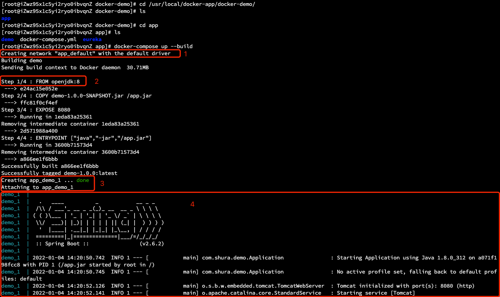

# Docker Compose

## 概述

使用微服务架构的应用系统一般包含若干个微服务，每个微服务一般都会部署多个实例。如果每个微服务都要手动启停，那么效率之低、维护工作量之大可想而知。
本节内容将讨论如何使用 `Docker Compose` 来轻松、高效地管理容器。为了简单起见将 `Docker Compose` 简称为 `Compose`。

`Compose` 是一个用于定义和运行多容器的 `Docker` 应用的工具。使用 `Compose`，你可以在一个配置文件（`yaml` 格式）中配置你应用的服务，然后使用一个命令，即可创建并启动配置中引用的所有服务。

## Docker Compose 的安装

Compose 的安装有多种方式，示例通过 `shell` 安装、通过 `pip` 安装、以及将 `compose` 作为容器安装等等。
本文讲解通过 `shell` 安装的方式。其他安装方式如有兴趣，可以查看：[Docker 的官方文档](https://docs.docker.com/compose/install/) 。

```shell
# docker compose安装步骤
# step 1
sudo curl -L "https://github.com/docker/compose/releases/download/1.28.6/docker-compose-$(uname -s)-$(uname -m)" -o /usr/local/bin/docker-compose
# step 2
sudo chmod +x /usr/local/bin/docker-compose
# step 3
docker-compose --version
```

## Docker Compose 入门示例

Compose 的使用非常简单，只需要编写一个 `docker-compose.yml`，然后使用 `docker-compose` 命令操作即可。`docker-compose.yml` 描述了容器的配置，而 `docker-compose` 命令描述了对容器的操作。

我们首先通过一个示例快速入门：
- 在 `demo-1.0.0-SNAPSHOT.jar` 所在目录的上一级目录，创建 `docker-compose.yml` 文件。

> 【注意】
> 
>  `demo-1.0.0-SNAPSHOT.jar` 包是本人构建的一个测试包，你可以自行构建一个可运行的 jar 包，再参考本文的步骤学习和使用。

目录树结构如下：
```text
├── docker-compose.yml
└── eureka
    ├── Dockerfile
    └── demo-1.0.0-SNAPSHOT.jar
```

- 然后在 `docker-compose.yml` 中添加如下内容：
```yaml
version: '3.8'
services:
  demo:                       # 指定服务名
    image: demo-1.0.0         # 指定镜像名称
    build: ./demo             # 指定 Dockerfile 所在路径
    ports:
      - "8761:8080"           # 指定端口映射
    expose:
      - 8080                  # 声明容器对外暴露的端口
```

- 在 `docker-compose.yml` 所在路径执行：
```shell
docker-compose up # -d 加上 -d 表示后台启动
```



如上图，compose 启动会做几件事：
1. 创建一个默认的网络 app_default，默认以 `compose` 所在文件目录名加 "_default" 命名，`compose` 内的所有容器都会加入此网络，可以互相使用服务名访问。
2. 如果镜像 `microservice-eureka-server-0.0.1` 不存在，则先构建镜像；如果镜像存在则不构建，加上 `--build` 参数可以**强制先构建镜像**，如果镜像之前构建过且构建文件没有变化或构建的内容没有变化，就算加上 `--build` 参数也不会重新构建。
3. 根据构建的镜像创建一个名称叫 `app_eureka_1` 的容器。
4. 启动容器。

- 访问：`http://宿主机 IP:8761/`，发现可以正常访问 eureka 的主页。

## Docker Compose 管理容器的结构

Docker Compose 将所管理的容器分为三层，分别是**工程**（`project`），**服务**（`service`）以及**容器**（`container`）。Docker Compose 运行目录下的所有文件（`docker-compose.yml`、`extends` 文件或环境变量文件等）组成一个工程（默认为 `docker-compose.yml` 所在目录的目录名称）。一个工程可包含多个服务，每个服务中定义了容器运行的镜像、参数和依赖，一个服务可包括多个容器实例。

上节示例里工程名称是 `docker-compose.yml` 所在的目录名。该工程包含了 1 个服务，服务名称是 `eureka`，执行 `docker-compose up` 时，启动了 `eureka` 服务的 1 个容器实例。

同一个 `docker compose` 内部的容器之间可以用服务名相互访问，**服务名就相当于 `hostname`，可以直接 `ping` 服务名，得到的就是服务对应容器的 ip，如果服务做了扩容，一个服务对应了多个容器，则 `ping` 服务名会轮询访问服务对应的每台容器ip ，docker 底层用了 `LVS` 等技术帮我们实现这个负载均衡**。

## docker-compose.yml 常用指令

### image

- 指定镜像名称或者镜像 id，如果该镜像在本地不存在，Compose 会尝试 `pull` 下来。
```yaml
image: java
```

### build 

- 指定 `Dockerfile` 文件的路径。可以是一个路径，示例：
```yaml
build: ./dir
```

- 也可以是一个对象，用以指定 `Dockerfile` 和参数，示例：
```yaml
build: 
  context: ./dir
  dockerfile: Dockerfile-alternate
  args:
    buildno: 1
```

### command

- 覆盖容器启动后默认执行的命令，示例：
```yaml
command: bundle exec thin -p 3000
```

- 也可以是一个 list，类似于 `Dockerfile` 中的 `CMD` 命令，示例：
```yaml
command: [bundle, exec, thin, -p, 3000]
```

### links

- 显示链接到其他服务中的容器。可以指定服务名称和链接的别名，使用 `SERVICE:ALIAS` 的形式，或只指定服务名称，示例：
```yaml
web: 
  links:
    - db
    - db:database
    - redis
```

### external_links

- 表示链接到 `docker-compose.yml` 外部的容器，甚至并非 Compose 管理的容器，特别是对那些提供共享容器或共同服务。格式跟 `links` 类似，示例：
```yaml
external_links:
  - redis_1
  - project_db_1:mysql
  - project_db_1:postgresql
```

### ports

- 暴露端口信息。使用 **宿主机端口:容器端口** 的格式，或仅仅指定容器的端口（此时宿主机将会随机指定端口），类似于 `docker run -p`，示例：
```yaml
ports:
  - "3000"
  - "3000-3005"
  - "8000:8000"
  - "9090-9091:8080-8081"
  - "49100:22"
  - "127.0.0.1:8081:8081"
  - "127.0.0.1:5000-5010:5000-5010"
```

### expose
暴露端口，只将端口暴露给连接的服务，而不暴露给宿主机，示例：
```yaml
expose:
  - "3000"
  - "8000"
```

### volumes

- 卷挂载路径设置，可以设置宿主机路径（`HOST:CONTAINER`）或加上访问模式（`HOST:CONTAINER:ro`）。示例：
```yaml
volumes:
  # Just specify a path and let the Engine create a volume
  - /var/lib/mysql

  # Specify an absolute path mapping
  - /opt/data:/var/lib/mysql

  # Path on the host, relative to the Compose file
  - ./cache:/tmp/cache

  # User-relative path
  - ~/configs:/etc/configs/:ro

  # Named volume
  - datavolume:/var/lib/mysql
```

### volumes_from

- 从另一个服务或容器挂载卷。可以指定只读或可读写，如果没有指定访问模式，则默认是可读写的。示例：
```yaml
volumes_from:
  - service_name
  - service_name:ro
  - container:container_name
  - container:container_name:rw
```

### environment

- 设置环境变量。可以使用数组或者字典两种方式。只有一个 key 的环境变量可以运行在 Compose 的机器上找到对应的值，这有助于加密的或者特殊主机的值。示例：
```yaml
environment:
  RACK_ENV: development
  SHOW: 'true'
  SESSION_SECRET:

# 或者：
environment:
  - RACK_ENV=development
  - SHOW=true
  - SESSION_SECRET
```

### env_file

- 从文件中获取环境变量，可以为单独的文件路径或列表。如果通过 `docker-compose -f FILE` 指定了模板文件，则 `env_file` 中路径会基于模板文件路径。如果有变量名称与 `environment` 指令冲突，则以 `environment` 为准。示例：
```yaml
env_file: .env
  
# 或者：
env_file:
  - ./common.env
  - ./apps/web.env
  - /opt/secrets.env
```

### extends 

- 继承另一个服务，基于已有的服务进行扩展。

### net

- 设置网络模式。示例：
```yaml
net: "bridge"

net: "host"

net: "none"

net: "container:[service name or container name/id]"
```

### dns

- 配置 dns 服务器。可以是一个值，也可以是一个列表。示例：
```yaml
dns: 8.8.8.8

# 或者：
dns:
  - 8.8.8.8
  - 9.9.9.9
```

### 其他

`docker-compose.yml` 还有很多其他命令，这里仅挑选常用命令进行讲解，其它不作赘述。如果感兴趣的，可以参考 `docker-compose.yml` 文件 [官方文档](https://docs.docker.com/compose/compose-file/) 。

## 用 Docker Compose 编排实战

如果微服务比较多，则可以用 `docker compose` 来统一编排，接下来我们用 `docker compose` 来统一编排基于 Spring Cloud 电商项目的 5 个微服务：`mall-authcenter`、`mall-gateway`、`mall-member`、`mall-order`、`mall-product`。

### 编排电商项目依赖环境
1. 创建一个空目录 `docker-mall`。
2. 在 `docker-mall` 目录下新建一个编排文件 `docker-compose-env.yml`，内容如下：
```yaml
version: '3.8'
services:
  mysql:
    image: mysql:5.7
    container_name: mysql
    command: mysqld --character-set-server=utf8mb4 --collation-server=utf8mb4_unicode_ci  # 覆盖容器启动后默认执行的启动 mysql 命令
    restart: always  # 关机或者重启机器时，docker 同时重启容器，一般 mysql 服务可以这么设置，保持服务一直都在
    environment:
      MYSQL_ROOT_PASSWORD: root # 设置root帐号密码
    ports:
      - 3306:3306
    volumes:
      - /mydata/mysql/data/db:/var/lib/mysql # 数据文件挂载
      - /mydata/mysql/data/conf:/etc/mysql/conf.d # 配置文件挂载
      - /mydata/mysql/log:/var/log/mysql # 日志文件挂载
  redis:   
    image: redis:5.0
    container_name: redis
    command: redis-server --appendonly yes  
    volumes:
      - /mydata/redis/data:/data # 数据文件挂载
    ports:
      - 6379:6379
  rabbitmq:
    image: rabbitmq:3.7.25-management
    container_name: rabbitmq
    volumes:
      - /mydata/rabbitmq/data:/var/lib/rabbitmq # 数据文件挂载
      - /mydata/rabbitmq/log:/var/log/rabbitmq # 日志文件挂载
    ports:
      - 5672:5672
      - 15672:15672
  elasticsearch:
    image: elasticsearch:6.4.0
    container_name: elasticsearch
    environment:
      - "cluster.name=elasticsearch" # 设置集群名称为 elasticsearch
      - "discovery.type=single-node" # 以单一节点模式启动
      - "ES_JAVA_OPTS=-Xms512m -Xmx512m" # 设置使用 jvm 内存大小，稍微配置大点，不然有可能启动不成功
    volumes:
      - /mydata/elasticsearch/plugins:/usr/share/elasticsearch/plugins # 插件文件挂载
      - /mydata/elasticsearch/data:/usr/share/elasticsearch/data # 数据文件挂载
    ports:
      - 9200:9200
      - 9300:9300
  kibana:
    image: kibana:6.4.0
    container_name: kibana
    links:  # 同一个 compose 文件管理的服务可以直接用服务名访问，如果要给服务取别名则可以用 links 实现，如下面的 es 就是 elasticsearch 服务的别名
      - elasticsearch:es # 可以用 es 这个域名访问 elasticsearch 服务
    depends_on:
      - elasticsearch # kibana 在 elasticsearch 启动之后再启动
    environment:
      - "elasticsearch.hosts=http://es:9200" # 设置访问 elasticsearch 的地址
    ports:
      - 5601:5601
  logstash:
    image: logstash:6.4.0
    container_name: logstash
    volumes:
      - /mydata/logstash/logstash-springboot.conf:/usr/share/logstash/pipeline/logstash.conf #挂载logstash的配置文件，docker对单个文件的挂载需要先在宿主机建好对应文件才能挂载成功
    depends_on:
      - elasticsearch # kibana 在 elasticsearch 启动之后再启动
    links:
      - elasticsearch:es # 可以用 es 这个域名访问 elasticsearch 服务
    ports:
      - 4560:4560
  mongo:
    image: mongo:3.2
    container_name: mongo
    volumes:
      - /mydata/mongo/db:/data/db # 数据文件挂载
    ports:
      - 27017:27017
  nacos:
    image: nacos/nacos-server:1.4.2
    container_name: nacos
    environment:
      - MODE=standalone
    volumes:
      - /mydata/nacos/logs/:/home/nacos/logs
    ports:
      - "8848:8848"
  zookeeper:
    image: zookeeper:3.5
    ports:
      - 2181:2181 
    volumes:
      - /mydata/zookeeper/data:/data
      - /mydata/zookeeper/conf:/conf
      
  rocketmq:
    image: rocketmqinc/rocketmq
    container_name: rocketmq
    restart: always    
    ports:
      - 9876:9876
    volumes:
      - /mydata/rocketmq/logs:/home/rocketmq/logs
      - /mydata/rocketmq/store:/home/rocketmq/store
    command: sh mqnamesrv
  broker:
    image: rocketmqinc/rocketmq
    container_name: rmqbroker
    restart: always    
    ports:
      - 10909:10909
      - 10911:10911
      - 10912:10912
    volumes:
      - /mydata/rocketmq/logs:/home/rocketmq/logs
      - /mydata/rocketmq/store:/home/rocketmq/store
      - /mydata/rocketmq/conf/broker.conf:/opt/rocketmq-4.4.0/conf/broker.conf  # 这个配置需要先在宿主机对应目录放好 broker.conf 配置文件,文件内容参考下面文档
    command: sh mqbroker -n namesrv:9876 -c ../conf/broker.conf
    depends_on:
      - rocketmq
    environment:
      - JAVA_HOME=/usr/lib/jvm/jre
  console:
    image: styletang/rocketmq-console-ng
    container_name: rocketmq-console-ng
    restart: always    
    ports:
      - 8076:8080
    depends_on:
      - rocketmq
    environment:
      - JAVA_OPTS= -Dlogging.level.root=info -Drocketmq.namesrv.addr=rocketmq:9876 
      - Dcom.rocketmq.sendMessageWithVIPChannel=false
```

broker.conf 文件内容如下：
```text
brokerName = broker-a
brokerId = 0
deleteWhen = 04
fileReservedTime = 48
brokerRole = ASYNC_MASTER
flushDiskType = ASYNC_FLUSH
# 宿主机IP
brokerIP1=192.168.0.1
```

3. 启动 compose 所有容器，在 docker-mall 目录下执行如下命令：
```shell
docker-compose -f docker-compose-env.yml up -d
```

### 编排电商微服务
1. 在 `docker-mall` 目录下分别创建 `mall-authcenter`、`mall-gateway`、`mall-member`、`mall-order`、`mall-product` 目录。
2. 修改电商项目上述几个微服务配置文件里面的中间件配置为上面 `docker compose` 里的服务名，并打好 jar 包放入对应的文件夹。
以 `mall-member` 服务为例，对应修改的配置文件如下（**注意：需要按照自己项目的配置文件去修改，不要直接使用这里的配置，有可能版本不对应**）。

- `bootstrap.yml` 文件配置：
```yaml
spring:
  application:
    name: mall-member
  cloud:
    nacos:
      config:
        server-addr: nacos:8848 # 配置中心的地址
        file-extension: yml # 配置文件结尾的配置
        shared-dataids: mall-nacos.yml,mall-db-common.yml # 公共配置
  profiles:
    active: dev
```

- `mall-member-dev.yml` 文件配置：
```yaml
server:
  port: 8877
  tomcat:
    max-threads: 100
spring:
  application:
    name: mall-member
  redis:
    host: redis
    port: 6379
    password:  # 密码
    timeout: 5000ms
    lettuce:
      pool:
        max-active: 50
        max-wait: -1ms
        max-idle: 8
        min-idle: 0
        
management: # 开启 Spring Boot Admin 的监控
  endpoints:
    web:
      exposure:
        include: '*'
  endpoint:
    health:
      show-details: always

seata:
  config:
    nacos:
      server-addr: nacos:8848
    type: nacos
  registry:
    type: nacos
  tx-service-group: my_test_tx_group
  client:
    support:
      spring:
        datasource-autoproxy: true

# zookeeper 配置
zk:
  curator:
    retryCount: 5 # 重试次数
    elapsedTimeMs: 5000
    connectUrl: zookeeper:2181 # zk 地址
    sessionTimeOutMs: 60000 # 会话超时时间
    connectionTimeOutMs: 5000 # 连接超时时间
```

- `mall-nacos.yml` 文件配置：
```yaml
spring:
  cloud:
    nacos:
      discovery:
        server-addr: nacos:8848
```

- `mall-db-common.yml` 文件配置：
```yaml
spring:
  datasource:
    url: jdbc:mysql://db:3306/micromall?serverTimezone=UTC&useSSL=false&useUnicode=true&characterEncoding=UTF-8
    username: root
    password: root
    druid:
      initial-size: 5 # 连接池初始化大小
      min-idle: 10 # 最小空闲连接数
      max-active: 20 # 最大连接数
      web-stat-filter:
        exclusions: "*.js,*.gif,*.jpg,*.png,*.css,*.ico,/druid/*" # 不统计这些请求数据
      stat-view-servlet: # 访问监控网页的登录用户名和密码
        login-username: druid
        login-password: druid
mybatis:
  mapper-locations:
    - classpath:dao/*.xml
    - classpath*:com/**/mapper/*.xml  
```

3. 在每个微服务目录下新建一个 `Dockerfile`，内容如下，以 mall-product 服务为例，其他微服务都类似修改：
```dockerfile
# 基于哪个镜像
FROM java:8
# 复制文件到容器
ADD mall-product-0.0.1-SNAPSHOT.jar /app.jar
# 配置容器启动后执行命令
ENTRYPOINT ["java", "-jar", "/app.jar"]
```

4. 在 `docker-mall` 目录下新建微服务编排文件 `docker-compose-app.yml`，内容如下：
```yaml
version: '3.8'
services:
  mall-authcenter:
    image: mall/mall-authcenter:0.0.1  # 指定镜像名称
    build: ./mall-authcenter  # 指定 Dockfile 所在路径
    container_name: mall-authcenter  # 指定启动容器名称
    ports:
      - 9999:9999
    volumes:
      - /etc/localtime:/etc/localtime:ro  # 同步宿主机与容器时间，ro 代表 readonly 只读
    environment:
      - JAVA_TOOL_OPTIONS=-Xmx1g -Xms1g -XX:MaxMetaspaceSize=512m -javaagent:/agent/skywalking-agent.jar -DSW_AGENT_NAME=mall-order -DSW_AGENT_COLLECTOR_BACKEND_SERVICES=192.168.65.204:11800
    external_links:  # 访问不在同一个 compose 文件管理的服务需要用 external_links，前提是这些服务都在同一个网络下才能正常访问 
      - nacos:nacos  # 可以用 nacos 这个域名访问 nacos 服务
      - mysql:db  # 可以用 db 这个域名访问 mysql 服务
    cap_add:
      - SYS_PTRACE # 这个参数是让 docker 能支持在容器里能执行 jdk 自带的类似 jinfo，jmap 这些命令，如果不需要在容器里执行这些命令可以不加
  mall-gateway:
    image: mall/-gateway:0.0.1
    build: ./mall-gateway
    container_name: mall-gateway
    ports:
      - 8888:8888
    volumes:
      - /etc/localtime:/etc/localtime:ro # 同步宿主机与容器时间
    environment:
      - JAVA_TOOL_OPTIONS=-Xmx1g -Xms1g -XX:MaxMetaspaceSize=512m -javaagent:/agent/skywalking-agent.jar -DSW_AGENT_NAME=mall-order -DSW_AGENT_COLLECTOR_BACKEND_SERVICES=192.168.65.204:11800
    depends_on:
      - mall-authcenter # gateway 在 authcenter 启动之后再启动
    external_links:
      - nacos:nacos
    cap_add:
      - SYS_PTRACE # 这个参数是让 docker 能支持在容器里能执行 jdk 自带的类似 jinfo，jmap 这些命令，如果不需要在容器里执行这些命令可以不加
  mall-member:
    image: mall/mall-member:0.0.1
    build: ./mall-member
    container_name: mall-member
    ports:
      - 8877:8877
    volumes:
      - /etc/localtime:/etc/localtime:ro # 同步宿主机与容器时间
    environment:
      - JAVA_TOOL_OPTIONS=-Xmx1g -Xms1g -XX:MaxMetaspaceSize=512m -javaagent:/agent/skywalking-agent.jar -DSW_AGENT_NAME=mall-order -DSW_AGENT_COLLECTOR_BACKEND_SERVICES=192.168.65.204:11800
    external_links:
      - nacos:nacos
      - mysql:db # 可以用 db 这个域名访问 mysql 服务
      - mongo
      - redis
      - rabbitmq
    cap_add:
      - SYS_PTRACE # 这个参数是让 docker 能支持在容器里能执行 jdk 自带的类似 jinfo，jmap 这些命令，如果不需要在容器里执行这些命令可以不加
  mall-product:
    image: mall/mall-product:0.0.1
    build: ./mall-product
    container_name: mall-product
    ports:
      - 8866:8866
    volumes:
      - /etc/localtime:/etc/localtime:ro # 同步宿主机与容器时间
    environment:
      - JAVA_TOOL_OPTIONS=-Xmx1g -Xms1g -XX:MaxMetaspaceSize=512m -javaagent:/agent/skywalking-agent.jar -DSW_AGENT_NAME=mall-order -DSW_AGENT_COLLECTOR_BACKEND_SERVICES=192.168.65.204:11800
    external_links:
      - nacos:nacos
      - mysql:db # 可以用 db 这个域名访问 mysql 服务
      - redis
      - zookeeper
    cap_add:
      - SYS_PTRACE # 这个参数是让 docker 能支持在容器里能执行 jdk 自带的类似 jinfo，jmap 这些命令，如果不需要在容器里执行这些命令可以不加
  mall-order:
    image: mall/mall-order:0.0.1
    build: ./mall-order
    container_name: mall-order
    ports:
      - 8844:8844
    volumes:
      - /etc/localtime:/etc/localtime:ro # 同步宿主机与容器时间
    environment:
      - JAVA_TOOL_OPTIONS=-Xmx1g -Xms1g -XX:MaxMetaspaceSize=512m -javaagent:/agent/skywalking-agent.jar -DSW_AGENT_NAME=mall-order -DSW_AGENT_COLLECTOR_BACKEND_SERVICES=192.168.65.204:11800
    external_links:
      - nacos:nacos
      - mysql:db # 可以用 db 这个域名访问 mysql 服务
      - redis
      - rabbitmq
      - namesrv:rockermq
    cap_add:
      - SYS_PTRACE # 这个参数是让 docker 能支持在容器里能执行 jdk 自带的类似 jinfo，jmap 这些命令，如果不需要在容器里执行这些命令可以不加
```

5. 启动 Compose 的所有微服务容器，在 `docker-mall` 目录执行如下命令：
```shell
# 这里启动的微服务跟上面启动的 mysql、redis 这些中间件服务因为都在 docker-mall 目录下，即都是在同一个工程目录下，默认都使用相同的网络下，可以相互访问
docker-compose -f docker-compose-app.yml up -d
```

6. 访问微服务的 api 看是否都正常。

### 动态扩容微服务（单物理机内扩容）

有时候我们需要扩容微服务，比如我们想把用户和订单微服务部署两个实例，则需要将 `docker-compose.yml` 里的服务端口映射和容器名称都注释掉，因为不可能两个订单服务的容器映射到宿主机的同一个端口，修改之后的 `docker-compose-app.yml` 文件内容如下：
```yaml
version: '3.8'
services:
  mall-authcenter:
    image: mall/mall-authcenter:0.0.1  # 指定镜像名称
    build: ./mall-authcenter  # 指定 Dockfile 所在路径
    container_name: mall-authcenter  # 指定启动容器名称
    ports:
      - 9999:9999
    volumes:
      - /etc/localtime:/etc/localtime:ro  # 同步宿主机与容器时间，ro 代表 readonly 只读
    environment:
      - JAVA_TOOL_OPTIONS=-Xmx1g -Xms1g -XX:MaxMetaspaceSize=512m -javaagent:/agent/skywalking-agent.jar -DSW_AGENT_NAME=mall-order -DSW_AGENT_COLLECTOR_BACKEND_SERVICES=192.168.65.204:11800
    external_links:  # 访问不在同一个 compose 文件管理的服务需要用 external_links，前提是这些服务都在同一个网络下才能正常访问 
      - nacos:nacos  # 可以用 nacos 这个域名访问 nacos 服务
      - mysql:db  # 可以用 db 这个域名访问 mysql 服务
    cap_add:
      - SYS_PTRACE # 这个参数是让 docker 能支持在容器里能执行 jdk 自带的类似 jinfo，jmap 这些命令，如果不需要在容器里执行这些命令可以不加
  mall-gateway:
    image: mall/-gateway:0.0.1
    build: ./mall-gateway
    container_name: mall-gateway
    ports:
      - 8888:8888
    volumes:
      - /etc/localtime:/etc/localtime:ro # 同步宿主机与容器时间
    environment:
      - JAVA_TOOL_OPTIONS=-Xmx1g -Xms1g -XX:MaxMetaspaceSize=512m -javaagent:/agent/skywalking-agent.jar -DSW_AGENT_NAME=mall-order -DSW_AGENT_COLLECTOR_BACKEND_SERVICES=192.168.65.204:11800
    depends_on:
      - mall-authcenter # gateway 在 authcenter 启动之后再启动
    external_links:
      - nacos:nacos
    cap_add:
      - SYS_PTRACE # 这个参数是让 docker 能支持在容器里能执行 jdk 自带的类似 jinfo，jmap 这些命令，如果不需要在容器里执行这些命令可以不加
  mall-member:
    image: mall/mall-member:0.0.1
    build: ./mall-member
#    container_name: mall-member
#    ports:
#      - 8877:8877
    volumes:
      - /etc/localtime:/etc/localtime:ro # 同步宿主机与容器时间
    environment:
      - JAVA_TOOL_OPTIONS=-Xmx1g -Xms1g -XX:MaxMetaspaceSize=512m -javaagent:/agent/skywalking-agent.jar -DSW_AGENT_NAME=mall-order -DSW_AGENT_COLLECTOR_BACKEND_SERVICES=192.168.65.204:11800
    external_links:
      - nacos:nacos
      - mysql:db # 可以用 db 这个域名访问 mysql 服务
      - mongo
      - redis
      - rabbitmq
    cap_add:
      - SYS_PTRACE # 这个参数是让 docker 能支持在容器里能执行 jdk 自带的类似 jinfo，jmap 这些命令，如果不需要在容器里执行这些命令可以不加
  mall-product:
    image: mall/mall-product:0.0.1
    build: ./mall-product
    container_name: mall-product
    ports:
      - 8866:8866
    volumes:
      - /etc/localtime:/etc/localtime:ro # 同步宿主机与容器时间
    environment:
      - JAVA_TOOL_OPTIONS=-Xmx1g -Xms1g -XX:MaxMetaspaceSize=512m -javaagent:/agent/skywalking-agent.jar -DSW_AGENT_NAME=mall-order -DSW_AGENT_COLLECTOR_BACKEND_SERVICES=192.168.65.204:11800
    external_links:
      - nacos:nacos
      - mysql:db # 可以用 db 这个域名访问 mysql 服务
      - redis
      - zookeeper
    cap_add:
      - SYS_PTRACE # 这个参数是让 docker 能支持在容器里能执行 jdk 自带的类似 jinfo，jmap 这些命令，如果不需要在容器里执行这些命令可以不加
  mall-order:
    image: mall/mall-order:0.0.1
    build: ./mall-order
#    container_name: mall-order
#    ports:
#      - 8844:8844
    volumes:
      - /etc/localtime:/etc/localtime:ro # 同步宿主机与容器时间
    environment:
      - JAVA_TOOL_OPTIONS=-Xmx1g -Xms1g -XX:MaxMetaspaceSize=512m -javaagent:/agent/skywalking-agent.jar -DSW_AGENT_NAME=mall-order -DSW_AGENT_COLLECTOR_BACKEND_SERVICES=192.168.65.204:11800
    external_links:
      - nacos:nacos
      - mysql:db # 可以用 db 这个域名访问 mysql 服务
      - redis
      - rabbitmq
      - namesrv:rockermq
    cap_add:
      - SYS_PTRACE # 这个参数是让 docker 能支持在容器里能执行 jdk 自带的类似 jinfo，jmap 这些命令，如果不需要在容器里执行这些命令可以不加
```

指定如下扩容命令，**服务一旦扩容对应了多个容器，则访问服务名 docker 会自动帮我们负载均衡去访问服务对应的每台容器实例**：
```shell
# 必须先正常编排微服务，然后才能动态扩容，文件有变动，需要重新创建容器
docker-compose -f docker-compose-app.yml up --force-recreate -d

docker-compose -f docker-compose-app.yml scale mall-member=2 mall-order=2

# 如果要缩容，则执行如下操作：
docker-compose -f docker-compose-app.yml scale mall-member=1 member-order=1
```

> 【**注意**】
> 
> docker compose 主要用在单物理机内扩容的情况，要做多机扩容则需要自己在多个机器上做很多定制化配置。
> 
> 当然，要做多物理机扩容一般都会使用 `docker swarm` 或 `kubernetes`。

## docker-compose 的常用命令

```shell
# 查看compose内的容器
docker-compose -f docker-compose-app.yml ps

# 关闭或启动或重启compose内的某个容器
docker-compose -f docker-compose-app.yml stop/start/restart <服务名>

# 关闭或重启compose所有容器
docker-compose -f docker-compose-app.yml stop/restart

# 查看compose所有容器的运行日志
docker-compose -f docker-compose-app.yml logs -f

# 查看compose下某个容器的运行日志
docker-compose -f docker-compose-app.yml logs -f <服务名>

# 也可以把compose的容器日志输出到日志文件里去，然后用tail -f 随时查看
docker-compose -f docker-compose-app.yml logs -f >> myDockerCompose.log &

# 重新构建有变化的镜像并更新到容器再启动
docker-compose -f docker-compose-app.yml up --build -d

# 重新创建docker-compose.yml配置有变化的容器并启动
docker-compose -f docker-compose-app.yml up --force-recreate -d

#停掉容器再删除容器
docker-compose -f docker-compose-app.yml down
```