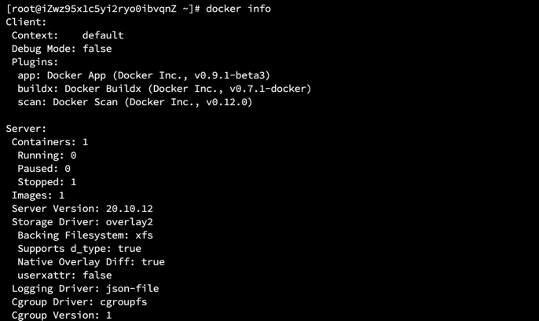
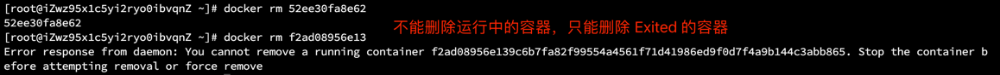

## 一、安装 Docker

官网安装步骤：[https://docs.docker.com/get-started/](https://docs.docker.com/get-started/)

### 1.1 卸载老版本

- 运行命令

```shell
sudo yum remove docker \
              docker-client \
              docker-client-latest \
              docker-common \
              docker-latest \
              docker-latest-logrotate \
              docker-logrotate \
              docker-engine
```

- 操作示范


### 1.2 使用仓库进行安装

#### 1.2.1 安装 yum-utils
- 运行命令

```shell
sudo yum install -y yum-utils
```

- 操作示范

  
#### 1.2.2 添加仓库

- 运行指令

```shell
sudo yum-config-manager \
  --add-repo  \
  https://download.docker.com/linux/centos/docker-ce.repo
```

- 操作示范

  
### 1.3 安装 Docker 引擎

- 运行指令
```shell
sudo yum install -y docker-ce docker-ce-cli containerd.io
```

- 操作示范


### 1.4 开启 Docker

- 运行指令

```shell
sudo systemctl start docker
```

### 1.5 验证 docker 引擎是否安装完毕

- 运行指令
```shell
sudo docker run hello-world
```

- 操作示范

 
>【**解释**】
> - docker 本机寻找镜像。 
> - 如果没有，则去 docker hub 上去查找。
> - 如果找到了，则下载镜像到本地。
> - 使用镜像运行。

### 1.6 其他操作
- 查看下载的镜像列表
```shell
docker images
```

- 配置 Docker 国内镜像地址（加快镜像下载速度）
```shell
# sudo mkdir -p /etc/docker
# sudo tee /etc/docker/daemon.json <<-'EOF'
{
  "registry-mirrors": ["https://aa25jngun.mirror.aliyuncs.com"]
}
EOF
# sudo systemctl daemon-reload
# sudo systemctl restart docker
```

- 卸载 Docker 引擎
```shell
sudo yum remove docker-ce docker-ce-cli containerd.io
```

- 删除 Docker 资源
```shell
sudo rm -rf /var/lib/docker
```

- 重新加载 Docker
```shell
sudo systemctl daemon-reload
```

- 重启 Docker
```shell
sudo systemctl restart docker
```

## Docker 命令

官网查看相关命令文档：[https://docs.docker.com/reference/](https://docs.docker.com/reference/)


### 2.1 基础命令
#### 2.1.1 查看版本
```shell
docker version
```


#### 2.1.2 显示 Docker 信息
```shell
docker info
```



#### 2.1.3 帮助命令
```shell
docker [命令] --help
```


#### 2.1.4 运行容器
```shell
docker run [OPTIONS] IMAGE [COMMAND] [ARG...]
```


> 备注： -it 表示进入容器，使用交互方式运行

#### 2.1.5 查看日志
```shell
docker logs [OPTIONS] CONTAINER
```


#### 2.1.6 查看容器中运行的进程信息
```shell
docker top [容器 id]
```


#### 2.1.7 查看容器元数据信息
```shell
docker inspect [OPTIONS] NAME|ID [NAME|ID ...]
```


#### 2.1.8 进入容器
- 开启一个新的终端，即：进入根目录（/）下
```shell
docker exec [OPTIONS] CONTAINER COMMAND [ARG...]
```


- 不开启新的终端，进入容器中正在运行的终端，即：退出时在什么目录状态，进入的时候还是那样。
```shell
docker attach [OPTIONS] CONTAINER
```


#### 2.1.9 文件拷贝
- docker cp SRC_PATH [容器 id]:DEST_PATH

将主机的 /home/garvey 路径下的 my.sql 文件拷贝到容器 f2ad08956e13 中的 home 目录下：
```shell
docker cp /home/garvey/my.sql f2ad08956e13:/home
```


- docker cp [容器 id]:SRC_PATH DEST_PATH

将容器 f2ad08956e13 中 home 目录下的 my.sql 文件拷贝到主机 /home/garvey 路径下：
```shell
docker cp f2ad08956e13:/home/my.sql /home/garvey
```

#### 2.1.10 查看 docker 中每个容器的运行状态
```shell
docker stats [OPTIONS] [CONTAINER...]
```


#### 2.1.11 运行时指定环境配置

- 某个容器启动后，非常耗费系统资源，那么需要在启动时指定该容器的配置。比如：启动一个 es，发现内存消耗为 1.5G，占用内存的 37% 左右。这样会比较消耗主机资源
- 那么为了减少不必要的资源消耗，在启动 es 的时候可以通过 -e 来指定它的最小和最大堆栈空间，来限制它所占用的内存。如下：
```shell
docker run -d -name es01 -p 9200:9200 -p 9300:9300 -e "discovery.type=single-node" -e ES_JAVA_OPTS="-Xms64m -Xmx512m" elasticsearch:7.10.1
```
- 这样，es 启动，占用的内存空间就会比较小。

### 2.2 镜像命令

#### 2.2.1 列出本机所有镜像
```shell
docker images
```


#### 2.2.2 搜索镜像
```shell
docker search [IAMGES]
```


> 【解释】
> - STARS：星星数，越多代表越受欢迎
> - OFFICIAL：官方认可
> - AUTOMATED：自动化的

列出所有 docker 商店中存在且星星数量 >=22 的所有 Redis 镜像
```shell
docker search redis -f=STARS=22
```


#### 2.2.3 下载镜像
```shell
docker pull redis # 默认下载最新镜像
```


```shell
docker pull rabbitmq:3.9.11 # 下载指定版本的镜像
```

- 查看对应镜像存在的版本


#### 2.2.4 删除镜像

- 删除指定单个镜像 id
```shell
docker rmi -f [IMAGE ID]
```

- 删除指定多个镜像 id
```shell
docker rmi -f [IMAGE ID] [IMAGE ID] [IMAGE ID]
```

- 删除所有镜像
```shell
docker rmi -f $(docker images -aq)
```

### 2.3 容器命令

### 2.3.1 运行容器
- 如果本地没有容器，则优先执行下载，再执行运行。

```shell
docker run [OPTIONS] IMAGE
```
- 参数解释：
    - --name="container01" 指定容器名字
    - -d 采用后台方式来运行容器
    - -it 进入容器，使用交互方式来运行
    - -p（小写 p） 指定容器的端口 -p 主机端口:容器端口
    - -P（大写 P） 随机指定端口
    
- 交互启动
```shell
docker run -it centos /bin//bash
```

- -d 仅后台启动（-p 外部暴露端口为 1111，映射 nginx 的端口为 80）
```shell
docker run -d --name nginx01 -p 1111:80 nginx
```

- 启动后，退出即删除容器（利用 --rm），即：docker ps -a 也查询不到
```shell
docker run -it --rm tomcat
```

#### 2.3.2 查询容器列表
```shell
docker ps [OPTIONS]
```

- 查询运行中的容器列表
```shell
docker ps
```


- 查询所有的容器列表（运行中 & 停止的）
```shell
docker ps -a
```


- 查询所有容器 id 列表集合（当需要对容器集合做批量操作时使用）
```shell
docker ps -aq
```


#### 2.3.3  退出容器

- 容器停止再退出（即：docker ps 查询不到该容器）
```shell
exit 或 CTRL + D
```

- 容器不停止并且退出
```text
按住 CTRL，依次按 p 和 q，即 CTRL + p + q
```

#### 2.3.4 删除容器
```shell
docker rm [OPTIONS] CONTAINER [CONTAINER...]
```

- 删除指定容器（只能删除 Exited 状态的容器）
```shell
docker rm [容器 id]
```



- 强制删除指定容器（采用 -f，强制删除指令可以删除任意状态的容器）
```shell
docker rm -f [容器 id]
```

- 删除所有容器
```shell
docker rm $(docker ps -aq)  # 要强制删除任意状态的容器，可以采用 -f
```

- 采用管道的方式删除容器
```shell
docker ps -aq | xargs docker rm
```

#### 2.3.5 启动容器
```shell
docker start [OPTIONS] CONTAINER [CONTAINER...]

# 示例：
docker start f2ad08956e13
```

#### 2.3.6 重启容器
```shell
docker restart [OPTIONS] CONTAINER [CONTAINER...]

# 示例：
docker restart f2ad08956e13
```

#### 2.3.7 停止容器
```shell
docker stop [OPTIONS] CONTAINER [CONTAINER...]

# 或
docker kill [OPTIONS] CONTAINER [CONTAINER...]

# 停止当前正在运行的容器
docker stop f2ad08956e13

# 强制停止当前容器
docker kill f2ad08956e13
```

#### 2.3.8 命令汇总大全

| 命令 | 解释 |
| ------ | ------ |
| attach | 当前 shell 下 attach 连接指定运行镜像 |
| build | 通过 Dockerfile 定制镜像 |
| commit | 提交当前容器为新的镜像 |
| cp | 从容器中拷贝指定文件或目录到主机中 |
| create | 创建一个新的容器，同 run，但不启动容器 |
| diff | 查看 docker 容器的变化 |
| events | 从 docker 服务获取容器实时事件 |
| exec | 在已存在的容器上运行命令 |
| export | 导出容器的内容流作为一个 tar 归档文件[对应 import] |
| history | 展示一个镜像形成历史 |
| images | 列出系统当前镜像 |
| import | 从 tar 包中的内容创建一个新的文件系统镜像[对应 export] |
| info | 显示系统相关信息 |
| inspect | 查看容器详细信息 |
| kill | kill 指定的容器 |
| load | 从一个 tar 包中加载一个镜像[对应 save] |
| login | 注册或登录一个 docker 源服务器 |
| logout | 从当前 docker registry 退出 |
| logs | 输出当前容器日志信息 |
| port | 查看映射端口对应的容器内部源端口 |
| pause | 暂停容器 |
| ps | 列出容器列表 |
| pull | 从 docker 镜像服务器拉取指定镜像或库镜像 |
| push | 推送指定镜像或者库镜像到 docker 源服务器 |
| restart | 重启运行的容器 |
| rm | 移除一个或多个容器 |
| rmi | 移除一个或多个镜像[无容器使用该镜像才可删除，否则需要删除相关容器才可以继续或 -f 强制删除] |
| run | 创建一个新的容器并运行一个命令 |
| save | 保存一个镜像为一个 tar 包[对应 load] |
| search | 在 docker hub 中搜索镜像 |
| start | 启动容器 |
| stop | 停止容器 |
| tag | 给源中镜像打标签 |
| top | 查看容器中运行的进程信息 |
| unpause | 取消暂停容器 |
| version | 查看 docker 版本号 |
| wait | 截取容器停止时的退出状态值 |