# Docker 进阶与实战

## 一、 Docker 镜像

### 1.1 什么是镜像
- 镜像是一种轻量级、可执行的独立执行软件包。包含代码、运行时、库、环境变量和配置文件。所有应用，直接打包 docker 镜像，就可以运行起来。
- 如何得到镜像：
    - 从远程仓库下载；
    - 其他人拷贝给你；
    - 自己制作一个镜像 DockerFile。
    
### 1.2 拉取镜像
拉取镜像操作如下所示：
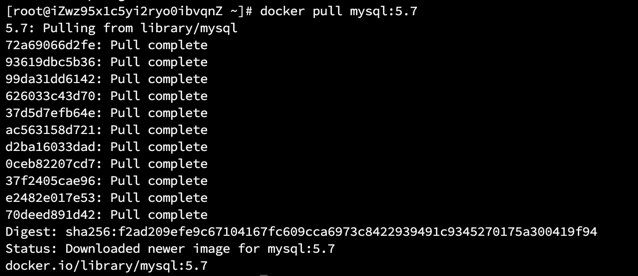

> 【解释】：
> 在下载的时候，看到的是**一层一层下载**，这个就是**联合文件系统** `UnionFS`
> - 联合文件系统（UnionFS）
> 
>   联合文件系统是一种**分层**、轻量级、高性能的文件系统。它支持对文件系统的修改作为一次提交来**一层层的叠加**。**联合文件系统是 Docker 镜像的基础**。镜像可以通过分层**进行继承**，基于基础镜像，可以制作各种具体的应用镜像。
> 
> - 分层
>   
>   分层最大的好处是**资源共享**或是**资源复用**，而且镜像的每一层都可以被共享。

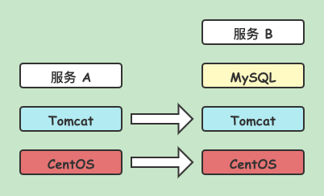

- 可以通过 `docker image inspect` 命令开查看分层，如下所示：


  
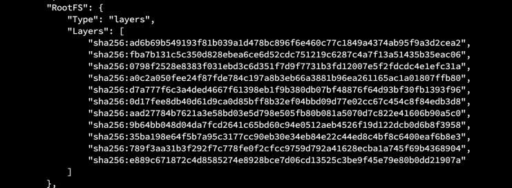

- docker 的镜像实际上是**由一层一层的文件系统组成**，这种层级的文件系统就叫做联合文件 -- UnionFS。
  - **bootfs（boot file system）**
    
    主要包含 `bootloader` 和 `kernel`。**`bootloader` 主要是引导加载 `kernel`**。Linux 刚启动时会加载 bootfs 文件系统，在 Docker 镜像的最底层就是 bootfs。
    bootfs 这一层与典型的 Linux、Unix 系统是一样的，包括 boot 加载器和内核。当 boot 加载完成之后，整个内核就在内存中了，此时内存的使用权已由 bootfs 转交给内核，此时系统也会卸载 bootfs。

  - **rootfs（root file system）**

    rootfs 在 bootfs 之上。包含的就是典型 Linux 系统中的 /dev、/proc、/bin、/etc 等标准目录和文件。**rootfs 就是各种不同操作系统的发行版本**。

  - 对于一个精简的 OS，rootfs 可以很小，只需要包含最基本的命令、工具和程序库就可以了，因为底层直接用 Host 的 `kernel`，自己只需要提供 rootfs 就可以了。由此可见，对于不同的 Linux 发行版本，bootfs 基本是一致的，rootfs 会有差别，因为不同的发行版本可以公用 bootfs。
  
### 1.3 镜像加载原理
- 所有 docker 镜像都起始于一个基础镜像层，当进行修改或者增加新的内容时，就会在当前镜像层之上，创建新的镜像层。如下图所示：


- 假如基于 `Ubuntu 16.4` 创建一个新的镜像，这就是新镜像的**第一层镜像层**；如果在该镜像中添加 `Python` 包，就会在基础镜像层之上创建**第二个镜像层**；如果继续添加一个安全补丁，就会创建**第三个镜像层**。
- 可以复用的，会在镜像加载的时候，直接复用。

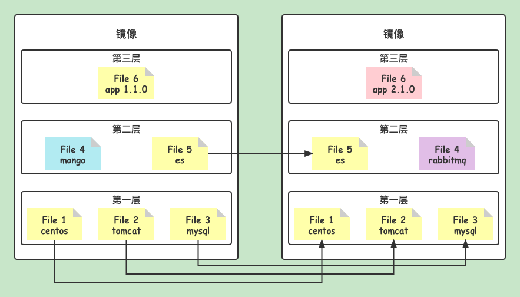

- docker 镜像都是**只读的**；当容器启动时，一个新的可写层被加载到镜像的顶部！这一层就是通常所说的**容器层**，容器之下的都叫**镜像层**。

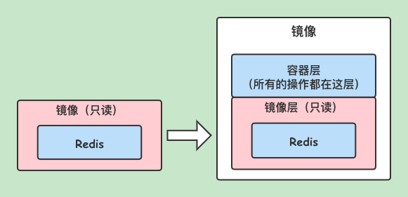

### 1.4 提交镜像
- 提交容器，成为一个新的副本。
```shell
docker commit [OPTIONS] CONTAINER [REPOSITORY[:TAG]]
```
- OPTIONS：
  - -a，--author string
  - -c，--change list
  - -m，--message string
  - -p，--pause
  
## 二、容器数据卷

### 2.1 什么是容器数据卷
- docker 是将应用和环境进行了打包。如果删掉容器的话，数据也会被同时删掉。那么，如果我们有**数据持久化**的需求，或者**容器之间数据共享**的需求，就要使用到容器数据卷了。如下图所示：

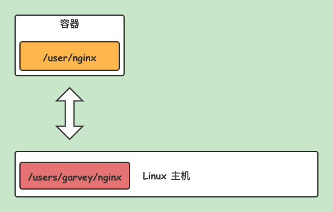

### 2.2 挂载操作
- 执行挂载（把本机路径 `/home/garvey/test`，挂到 centos 容器的 `/bin/bash` 目录下）
```shell
docker run -it -v /home/garvey/test:/home centos /bin/bash
```

- 在容器里创建一个文件 a.txt
```text
[root@85f80c54a0af /]# cd home 
[root@85f80c54a0af home]# ls
[root@85f80c54a0af home]# echo "" > a.txt
[root@85f80c54a0af home]# ls
a.txt
```

- 然后再开启一个终端，登录查看 `/home/garvey/test` 路径，发现已经存在一个 a.txt 的文件了
```text
[root@iZwz95x1c5yi2ryo0ibvqnZ ~]# cd /home/garvey/test
[root@iZwz95x1c5yi2ryo0ibvqnZ test]# ls
a.txt
```

- 查看挂载信息
```text
[root@iZwz95x1c5yi2ryo0ibvqnZ ~]# docker ps
CONTAINER ID   IMAGE     COMMAND       CREATED         STATUS         PORTS     NAMES
85f80c54a0af   centos    "/bin/bash"   3 minutes ago   Up 3 minutes             unruffled_khorana
f2ad08956e13   centos    "/bin/bash"   5 hours ago     Up 4 hours               happy_mendeleev
[root@iZwz95x1c5yi2ryo0ibvqnZ ~]# docker inspect 85f80c54a0af
```

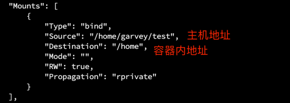

### 2.3 实战 - 给 mysql 挂载数据卷
- 获取 mysql 镜像
```shell
docker pull mysql:5.7
```

- 启动 mysql
```shell
docker run -d -p 3306:3306 --name mysql -v /home/mysql/conf:/etc/mysql/conf.d -v /home/mysql/data:/var/lib/mysql -e MYSQL_ROOT_PASSWORD=root mysql:5.7
```

> 【解释】
> - -d 后台运行
> - -p 端口映射
> - -v 数据卷挂载
> - -e 环境配置
> - --name 容器名称

- 查看 docker 里的容器列表，已经存在 mysql 容器了

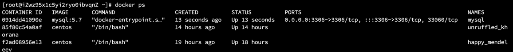


- 查看挂载路径 `/home/mysql/`，发现已经有文件存在了

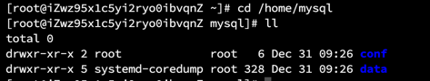


- 连接 DB，验证 mysql 是否启动成功

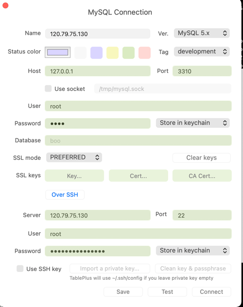
  

- 创建新的 Schema，名称为 garvey

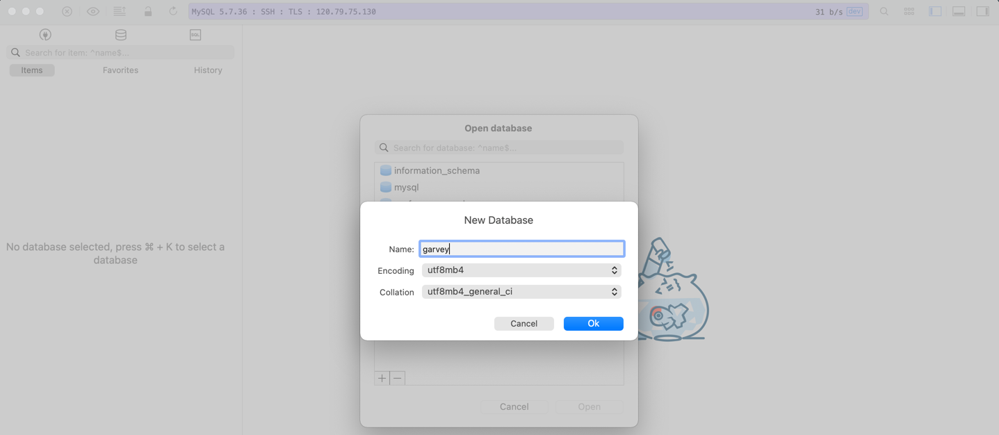
  

- 创建完毕后，我们发现多了一个 garvey 的文件夹，这说明挂载数据是同步的

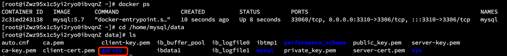

- 即使删除了 mysql 容器，挂载的数据依然存在，不会丢失

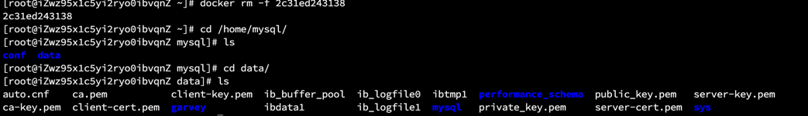

### 2.4 具名挂载和匿名挂载

- 查看所有卷和列表
```shell
docker volume ls
```

#### 2.4.1 匿名挂载
- 通过 -v 指定容器内路径
```shell
[root@iZwz95x1c5yi2ryo0ibvqnZ ~]# docker run -d -P --name nginx1 -v :/etc/nginx nginx
98ca3bb3155da273086ffa2417b3616b31a3ee1ce24fe0d1e6a4d3dbc7057603

[root@iZwz95x1c5yi2ryo0ibvqnZ ~]# docker volume ls
DRIVER    VOLUME NAME
local     eb9f7aa968ebac6bcac494b12e0bd9ad2ac20399e9a04deabd467ed6fd16e871
```

> 【注】匿名挂载，在 -v 只写了容器内的路径，没有写容器外的路径

#### 2.4.2 具名挂载
- 常用方式，通过 -v 卷名:容器内路径，指定具名挂载
```shell
[root@iZwz95x1c5yi2ryo0ibvqnZ ~]# docker run -d -P --name nginx2 -v nginx2:/etc/nginx nginx
f15fdb88155558f4f5f23b20f86dc11e008c5d99b1e481bb02bc69e2ae4f88c4

[root@iZwz95x1c5yi2ryo0ibvqnZ ~]# docker volume ls
DRIVER    VOLUME NAME
local     eb9f7aa968ebac6bcac494b12e0bd9ad2ac20399e9a04deabd467ed6fd16e871
local     nginx2
```

- 查看挂载信息
```shell
[root@iZwz95x1c5yi2ryo0ibvqnZ ~]# docker volume inspect nginx2 
[
    {
        "CreatedAt": "2021-12-31T10:18:50+08:00",
        "Driver": "local",
        "Labels": null,
        "Mountpoint": "/var/lib/docker/volumes/nginx2/_data",
        "Name": "nginx2",
        "Options": null,
        "Scope": "local"
    }
]
```

> 【注】所有的 docker 容器内的卷，没有指定目录的情况下都是在 `/var/lib/docker/volumes/xxx/_data` 下。

- 查看挂载路径
```shell
[root@iZwz95x1c5yi2ryo0ibvqnZ ~]# cd /var/lib/docker/volumes/nginx2/_data
[root@iZwz95x1c5yi2ryo0ibvqnZ _data]# ll
total 24
drwxr-xr-x 2 root root   26 Dec 31 10:18 conf.d
-rw-r--r-- 1 root root 1007 Dec 28 23:28 fastcgi_params
-rw-r--r-- 1 root root 5349 Dec 28 23:28 mime.types
lrwxrwxrwx 1 root root   22 Dec 28 23:40 modules -> /usr/lib/nginx/modules
-rw-r--r-- 1 root root  648 Dec 28 23:40 nginx.conf
-rw-r--r-- 1 root root  636 Dec 28 23:28 scgi_params
-rw-r--r-- 1 root root  664 Dec 28 23:28 uwsgi_params
```

> 【总结】
> - 匿名挂载：-v 容器内路径
> - 具名挂载：-v 卷名:容器内路径
> - 指定路径挂载：-v 宿主机路径:容器内路径
> - 设置容器的读写权限：
>   - ro 只读权限（read only），只能通过宿主机来操作了，容器内无法操作
>       
>     `docker run -d -P --name nginx2 -v nginx2:/etc/nginx:ro nginx`
>   
>   - rw 读写权限（read write） 
>     
>     `docker run -d -P --name nginx2 -v nginx2:/etc/nginx:rw nginx`

#### 2.4.3 数据卷容器
- 基于自己创建的镜像，我们可以来实现多个容器直接的数据卷挂载操作。

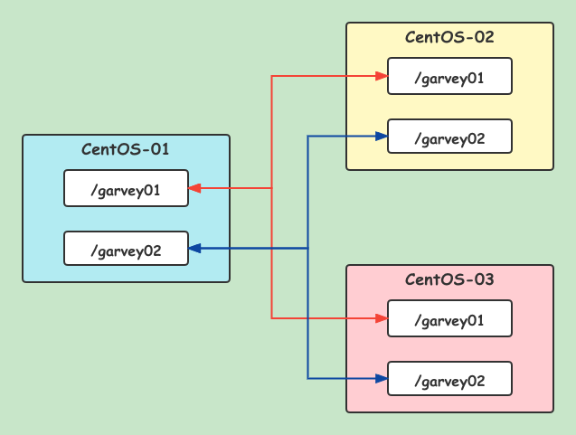

- 启动 centOS-01
```shell
docker run -it --name centOS-01 9ecb508c7606

# CTRL + P + Q  退出
```

> 【注】
>
> 9ecb508c7606 是我自己创建的镜像 id，有关镜像的创建请参考 [Dockerfile 最佳实践](Dockerfile%20最佳实践.md)

- 启动 centOS-02
```shell
docker run -it --name centOS-02 --volumes-from centOS-01 9ecb508c7606

# CTRL + P + Q  退出
```

- 启动 centOS-03
```shell
docker run -it --name centOS-03 --volumes-from centOS-01 9ecb508c7606

# CTRL + P + Q  退出
```

- 查看容器进程
```shell
[root@iZwz95x1c5yi2ryo0ibvqnZ _data]# docker ps
CONTAINER ID   IMAGE          COMMAND                  CREATED          STATUS          PORTS      NAMES
43f123d65c0e   9ecb508c7606   "/bin/sh -c /bin/bash"   3 minutes ago    Up 3 minutes               centOS-03
15a022bfba0c   9ecb508c7606   "/bin/sh -c /bin/bash"   3 minutes ago    Up 3 minutes               centOS-02
2e8c5fb0b683   9ecb508c7606   "/bin/sh -c /bin/bash"   4 minutes ago    Up 4 minutes               centOS-01
```

- 在 centOS-03 的 garvey01 目录中新建 a.txt
```shell
[root@iZwz95x1c5yi2ryo0ibvqnZ _data]# docker attach 43f123d65c0e
[root@43f123d65c0e /]# ls
bin  dev  etc  garvey01  garvey02  home  lib  lib64  lost+found  media  mnt  opt  proc  root  run  sbin  srv  sys  tmp  usr  var
[root@43f123d65c0e /]# cd garvey01
[root@43f123d65c0e garvey01]# ls
[root@43f123d65c0e garvey01]# touch a.txt
[root@43f123d65c0e garvey01]# ls
a.txt

# CTRL + P + Q  退出
```

- 查看 centOS-02 的 garvey01 目录中是否有 a.txt
```shell
[root@iZwz95x1c5yi2ryo0ibvqnZ _data]# docker attach 15a022bfba0c
[root@15a022bfba0c /]# ls
bin  dev  etc  garvey01  garvey02  home  lib  lib64  lost+found  media  mnt  opt  proc  root  run  sbin  srv  sys  tmp  usr  var
[root@15a022bfba0c /]# cd garvey01
[root@15a022bfba0c garvey01]# ls
a.txt

# CTRL + P + Q  退出
```

>【注】 
> 
> 有 a.txt 这个文件，说明已经同步了在 centOS-03 中的操作

- 查看 centOS-01 的 garvey01 目录是否有 a.txt
```shell
[root@iZwz95x1c5yi2ryo0ibvqnZ _data]# docker attach 2e8c5fb0b683
[root@2e8c5fb0b683 /]# ls
bin  dev  etc  garvey01  garvey02  home  lib  lib64  lost+found  media  mnt  opt  proc  root  run  sbin  srv  sys  tmp  usr  var
[root@2e8c5fb0b683 /]# cd garvey01
[root@2e8c5fb0b683 garvey01]# ls
a.txt

# CTRL + P + Q  退出
```

>【注】 
> 
> 有 a.txt 这个文件，说明已经同步了在 centOS-03 中的操作

- 假设把 centOS-03 删除掉，看 centOS-01 和 centOS-02 中的 garvey01 目录下是否有 a.txt
```shell
[root@iZwz95x1c5yi2ryo0ibvqnZ _data]# docker rm -f 43f123d65c0e
43f123d65c0e
[root@iZwz95x1c5yi2ryo0ibvqnZ _data]# docker ps
CONTAINER ID   IMAGE          COMMAND                  CREATED          STATUS          PORTS     NAMES
15a022bfba0c   9ecb508c7606   "/bin/sh -c /bin/bash"   9 minutes ago    Up 9 minutes              centOS-02
2e8c5fb0b683   9ecb508c7606   "/bin/sh -c /bin/bash"   9 minutes ago    Up 9 minutes              centOS-01
[root@iZwz95x1c5yi2ryo0ibvqnZ _data]# docker attach 15a022bfba0c
[root@15a022bfba0c garvey01]# ls
a.txt
```

> 【注】我们发现，即使删除了 centOS-03 之后，centOS-01 和 centOS-02 里的 garvey01 目录下依然有 a.txt 文件。
> 这就表明了，centOS-01 ~ centOS-03 这三个容器中 a.txt 文件是**互相同步复制备份**的，而**并不是同享了某个目录**，三者都去查看一个备份。
