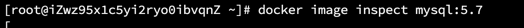

# Docker 进阶与实战

## 一、 Docker 镜像

### 1.1 什么是镜像
- 镜像是一种轻量级、可执行的独立执行软件包。包含代码、运行时、库、环境变量和配置文件。所有应用，直接打包 docker 镜像，就可以运行起来。
- 如何得到镜像：
    - 从远程仓库下载；
    - 其他人拷贝给你；
    - 自己制作一个镜像 DockerFile。
    
### 1.2 拉取镜像
拉取镜像操作如下所示：


> 【解释】：
> 在下载的时候，看到的是**一层一层下载**，这个就是**联合文件系统** `UnionFS`
> - 联合文件系统（UnionFS）
> 
>   联合文件系统是一种**分层**、轻量级、高性能的文件系统。它支持对文件系统的修改作为一次提交来**一层层的叠加**。**联合文件系统是 Docker 镜像的基础**。镜像可以通过分层**进行继承**，基于基础镜像，可以制作各种具体的应用镜像。
> 
> - 分层
>   
>   分层最大的好处是**资源共享**或是**资源复用**，而且镜像的每一层都可以被共享。


- 可以通过 `docker image inspect` 命令开查看分层，如下所示：


  


- docker 的镜像实际上是**由一层一层的文件系统组成**，这种层级的文件系统就叫做联合文件 -- UnionFS。
  - **bootfs（boot file system）**
    
    主要包含 `bootloader` 和 `kernel`。**`bootloader` 主要是引导加载 `kernel`**。Linux 刚启动时会加载 bootfs 文件系统，在 Docker 镜像的最底层就是 bootfs。
    bootfs 这一层与典型的 Linux、Unix 系统是一样的，包括 boot 加载器和内核。当 boot 加载完成之后，整个内核就在内存中了，此时内存的使用权已由 bootfs 转交给内核，此时系统也会卸载 bootfs。

  - **rootfs（root file system）**

    rootfs 在 bootfs 之上。包含的就是典型 Linux 系统中的 /dev、/proc、/bin、/etc 等标准目录和文件。**rootfs 就是各种不同操作系统的发行版本**。

  - 对于一个精简的 OS，rootfs 可以很小，只需要包含最基本的命令、工具和程序库就可以了，因为底层直接用 Host 的 `kernel`，自己只需要提供 rootfs 就可以了。由此可见，对于不同的 Linux 发行版本，bootfs 基本是一致的，rootfs 会有差别，因为不同的发行版本可以公用 bootfs。
  
### 1.3 镜像加载原理
- 所有 docker 镜像都起始于一个基础镜像层，当进行修改或者增加新的内容时，就会在当前镜像层之上，创建新的镜像层。如下图所示：


- 假如基于 `Ubuntu 16.4` 创建一个新的镜像，这就是新镜像的**第一层镜像层**；如果在该镜像中添加 `Python` 包，就会在基础镜像层之上创建**第二个镜像层**；如果继续添加一个安全补丁，就会创建**第三个镜像层**。
- 可以复用的，会在镜像加载的时候，直接复用。


- docker 镜像都是**只读的**；当容器启动时，一个新的可写层被加载到镜像的顶部！这一层就是通常所说的**容器层**，容器之下的都叫**镜像层**。


### 1.4 提交镜像
- 提交容器，成为一个新的副本。
```shell
docker commit [OPTIONS] CONTAINER [REPOSITORY[:TAG]]
```
- OPTIONS：
  - -a，--author string
  - -c，--change list
  - -m，--message string
  - -p，--pause
  
## 二、容器数据卷

### 2.1 什么是容器数据卷
- docker 是将应用和环境进行了打包。如果删掉容器的话，数据也会被同时删掉。那么，如果我们有**数据持久化**的需求，或者**容器之间数据共享**的需求，就要使用到容器数据卷了。如下图所示：


### 2.2 挂载操作
- 执行挂载（把本机路径 `/home/garvey/test`，挂到 centos 容器的 `/bin/bash` 目录下）
```shell
docker run -it -v /home/garvey/test:/home centos /bin/bash
```

- 在容器里创建一个文件 a.txt
```text
[root@85f80c54a0af /]# cd home 
[root@85f80c54a0af home]# ls
[root@85f80c54a0af home]# echo "" > a.txt
[root@85f80c54a0af home]# ls
a.txt
```

- 然后再开启一个终端，登录查看 `/home/garvey/test` 路径，发现已经存在一个 a.txt 的文件了
```text
[root@iZwz95x1c5yi2ryo0ibvqnZ ~]# cd /home/garvey/test
[root@iZwz95x1c5yi2ryo0ibvqnZ test]# ls
a.txt
```

- 查看挂载信息
```text
[root@iZwz95x1c5yi2ryo0ibvqnZ ~]# docker ps
CONTAINER ID   IMAGE     COMMAND       CREATED         STATUS         PORTS     NAMES
85f80c54a0af   centos    "/bin/bash"   3 minutes ago   Up 3 minutes             unruffled_khorana
f2ad08956e13   centos    "/bin/bash"   5 hours ago     Up 4 hours               happy_mendeleev
[root@iZwz95x1c5yi2ryo0ibvqnZ ~]# docker inspect 85f80c54a0af
```


### 2.3 实战 - 给 mysql 挂载数据卷
- 获取 mysql 镜像