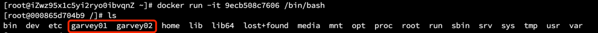

# Dockerfile 最佳实践

本节内容是对 Docker 官方文档中 [Best practices for writing Dockerfiles](https://docs.docker.com/develop/develop-images/dockerfile_best-practices/) 的翻译与理解。

## 什么是 Dockerfile？

`Dockerfile` 就是命令脚本，用来构建 docker 镜像文件的。

### 构建步骤
1. 编写一个 `Dockerfile` 文件。
2. 执行 `docker build` 命令，构建一个镜像。
3. 执行 `docker run` 命令，运行镜像。
4. `docker push` 发布镜像，可以发布到 Docker Hub、阿里云镜像仓库等。

前往：[Docker Hub](https://hub.docker.com)

## 一般性的指南和建议

### 容器应该是短暂的
通过 `Dockerfile` 构建的镜像所启动的容器应该尽可能短暂（**生命周期短**）。"**短暂**"意味着可以停止和销毁容器，并且创建一个新容器并部署好所需的设置和配置工作量应该是极小的。

### 使用 `.dockerignore` 文件
建议将 `Dockerfile` 放置在一个新建的空目录下，方便管理，然后将构建镜像所需要的文件添加到该目录中。
我们可以在新目录下创建一个 `.dockerignore` 文件来指定要排除的文件和目录，这样做可以提高构建效率。`.dockerignore` 文件的排除模式语法和 Git 的 `.gitignore` 文件相似。

### 使用多阶段构建
可以使用**多阶段构建**来减少所构建镜像的大小，即最小化镜像层（**Docker 17.05 以上的版本才支持**）。

### 避免安装不必要的包
为了降低复杂性、减少依赖、减小文件大小、节省构建时间，你应该避免安装任何不必要的包。例如，不要在数据库镜像中包含一个文本编辑器。

### 解耦应用程序
每个容器应该只有一个关注点。将应用程序解耦到多个容器中，可以更轻松地进行水平扩展和重用容器。例如，Web 应用程序堆栈可能由三个独立的容器组成，每个容器都有自己独特的映像，以分离的方式管理 Web 应用程序、数据库和内存缓存。

简单来说，就是应该保证在**一个容器中只运行一个进程**。

如果容器互相依赖，你可以使用 **Docker 自定义网络**来把这些容器连接起来。

### 镜像层数尽可能少
在旧版本的 Docker 中，尽量减少镜像中的层数以确保它们的性能非常重要。 较新的版本添加了以下功能以减少此限制：
- 只有说明 RUN，COPY，ADD 创建图层。其他指令会创建临时中间映像，并且不会增加构建的大小。
- 在可能的情况下，使用**多阶段构建**，并且只将需要的工件复制到最终映像中。这允许我们在中间构建阶段包含工具和调试信息，而不会增加最终映像的大小。

你需要在 `Dockerfile` 可读性（也包括长期的可维护性）和减少层数之间做一个平衡。

### 将多行参数排序
通过按字母数字顺序对多行参数进行排序来简化以后的更改。这有助于避免包重复并使列表更易于更新。这也使 `PRs` 更易于阅读和审查。建议在反斜杠符号 \ 之前添加一个空格，以增加可读性。

下面是来自 `buildpack-deps` 镜像的例子：
```shell
RUN apt-get update && apt-get install -y \
  bzr \
  cvs \
  git \
  mercurial \
  subversion
```

### 利用构建缓存
在镜像的构建过程中，Docker 会遍历 `Dockerfile` 文件中的指令，然后按顺序执行。在执行每条指令之前，Docker 都会在缓存中查找是否已经存在可重用的镜像，如果有就使用现存的镜像，不再重复创建。如果你不想在构建过程中使用缓存，你可以在 `docker build` 命令中使用 `--no-cache=true` 选项。

但是，如果你想在构建的过程中使用缓存，你需要明白什么时候会，什么时候不会找到匹配的镜像，遵循的基本规则如下：

- 从一个基础镜像开始（`FROM` 指令指定），下一条指令将和该基础镜像的所有子镜像进行匹配，检查这些子镜像被创建时使用的指令是否和被检查的指令完全一样。如果不是，则缓存失效。
- 在大多数情况下，只需要简单地对比 `Dockerfile` 中的指令和子镜像。然而，有些指令需要更多的检查和解释。
- 对于 `ADD` 和 `COPY` 指令，镜像中对应文件的内容也会被检查，每个文件都会计算出一个校验和。文件的最后修改时间和最后访问时间不会纳入校验。在缓存的查找过程中，会将这些校验和和已存在镜像中的文件校验和进行对比。如果文件有任何改变，比如内容和元数据，则缓存失效。
- 除了 `ADD` 和 `COPY` 指令，缓存匹配过程不会查看临时容器中的文件来决定缓存是否匹配。例如，当执行完 `RUN apt-get -y update` 指令后，容器中一些文件被更新，但 Docker 不会检查这些文件。这种情况下，只有指令字符串本身被用来匹配缓存。

一旦缓存失效，所有后续的 `Dockerfile` 指令都将产生新的镜像，缓存不会被使用。

## Dockerfile 指令

下面针对 `Dockerfile` 中各种指令的最佳编写方式而给出的建议。

### FROM
尽可能使用当前的官方仓库作为构建镜像的基础。推荐使用 [Alpine 镜像](https://hub.docker.com/_/alpine/) ，因为它被严格控制并保持最小尺寸（目前小于 5 MB），但它仍然是一个完整的发行版。

### LABEL
你可以给镜像添加标签来帮助组织镜像、记录许可信息、辅助自动化构建等。每个标签一行，由 `LABEL` 开头加上一个或多个标签对。下面的示例展示了各种不同的可能格式。`#` 开头的行是注释内容。

注意：如果你的字符串中包含空格，必须将字符串放入引号中或者对空格使用转义。如果字符串内容本身就包含引号，必须对引号使用转义。

- 示例：
```shell
# Set one or more individual labels
LABEL com.example.version="0.0.1-beta"
LABEL vendor1="ACME Incorporated"
LABEL vendor2=ZENITH\ Incorporated
LABEL com.example.release-date="2015-02-12"
LABEL com.example.version.is-production=""
```

一个镜像可以包含多个标签，但建议将多个标签放入到一个 `LABEL` 指令中。

- 上面的示例也可以写成：
```shell
# Set multiple labels at once, using line-continuation characters to break long lines
LABEL vendor=ACME\ Incorporated \
      com.example.is-beta= \
      com.example.is-production="" \
      com.example.version="0.0.1-beta" \
      com.example.release-date="2015-02-12"
```

关于标签可以接受的键值对，参考 [Understanding object labels](https://docs.docker.com/config/labels-custom-metadata/) 。关于查询标签信息，参考 [Managing labels on objects](https://docs.docker.com/config/labels-custom-metadata/#manage-labels-on-objects) 。

### RUN
[RUN 指令的 Dockerfile 参考](https://docs.docker.com/engine/reference/builder/#run)

将较长或复杂的 `RUN` 语句拆分成多行，以反斜杠（` \ `）分隔，可以提升 `Dockerfile` 文件的可读性、可理解性和可维护性

### apt-get
`RUN` 指令最常见的用法是安装包用的 `apt-get`。因为 `RUN apt-get` 指令会安装包，所以有几个问题需要注意。

**不要使用** `RUN apt-get upgrade` 或 `dist-upgrade`，因为许多基础镜像中的「**必须**」包不会在一个非特权容器中升级。如果基础镜像中的某个包过时了，你应该联系它的维护者。如果你确定某个特定的包，比如 `foo`，需要升级，使用 `apt-get install -y foo` 就行，该指令会自动升级 `foo` 包。

永远将 `RUN apt-get update` 和 `apt-get install` 组合成一条 `RUN` 声明，例如：

```shell
RUN apt-get update && apt-get install -y \
    package-bar \
    package-baz \
    package-foo  \
    && rm -rf /var/lib/apt/lists/*
```

- 将 `apt-get update` 放在一条单独的 `RUN` 声明中会导致缓存问题以及后续的 `apt-get install` 失败。比如，假设你有一个 `Dockerfile` 文件：
```shell
# syntax=docker/dockerfile:1
FROM ubuntu:18.04
RUN apt-get update
RUN apt-get install -y curl
```

- 构建镜像后，所有的层都在 Docker 的缓存中。假设你后来又修改了其中的 `apt-get install` 添加了一个包：
```shell
# syntax=docker/dockerfile:1
FROM ubuntu:18.04
RUN apt-get update
RUN apt-get install -y curl nginx
```

Docker 发现修改后的 `RUN apt-get update` 指令和之前的完全一样。所以，`apt-get update` 不会执行，而是使用之前的缓存镜像。因为 `apt-get update` 没有运行，后面的 `apt-get install` 可能安装的是过时的 `curl` 和 `nginx` 版本。

使用 `RUN apt-get update && apt-get install -y` 可以确保你的 `Dockerfile` 每次安装的都是包的最新的版本，而且这个过程不需要进一步的编码或额外干预。这项技术叫作**缓存破坏**（`cache busting`）。你也可以显示指定一个包的版本号来达到 `cache-busting`，这就是所谓的固定版本，例如：
```shell
RUN apt-get update && apt-get install -y \
    package-bar \
    package-baz \
    package-foo=1.3.*
```

固定版本会迫使构建过程检索特定的版本，而不管缓存中有什么。这项技术也可以减少因所需包中未预料到的变化而导致的失败。

- 下面是一个 `RUN` 指令的示例模板，展示了所有 `apt-get` 的建议。
```shell
RUN apt-get update && apt-get install -y \
    aufs-tools \
    automake \
    build-essential \
    curl \
    dpkg-sig \
    libcap-dev \
    libsqlite3-dev \
    mercurial \
    reprepro \
    ruby1.9.1 \
    ruby1.9.1-dev \
    s3cmd=1.1.* \
 && rm -rf /var/lib/apt/lists/*
```

其中 `s3cmd` 指令指定了一个版本号 `1.1.*`。如果之前的镜像使用的是更旧的版本，指定新的版本会导致 `apt-get update` 缓存失效并确保安装的是新版本。

另外，清理掉 apt 缓存 `var/lib/apt/lists` 可以减小镜像大小。因为 `RUN` 指令的开头为 `apt-get update`，包缓存总是会在 `apt-get install` 之前刷新。

> 注意：官方的 Debian 和 Ubuntu 镜像会自动运行 `apt-get clean`，所以不需要显式的调用 `apt-get clean`。

### 使用 pipes

某些 `RUN` 命令依赖于使用管道字符（` | `）将一个命令的输出通过管道传输到另一个命令的能力，如下例所示：

```shell
RUN wget -O - https://some.site | wc -l > /number
```

Docker 使用 `/bin/sh -c` 解释器执行这些命令，它只评估管道中最后一个操作的退出代码来确定成功。在上面的示例中，只要 `wc -l` 命令成功，即使 `wget` 命令失败，此构建步骤也会成功并生成新映像。

如果你希望命令因管道中任何阶段的错误而失败，请预先添加 `set -o pipefail &&` 以确保意外错误防止构建意外成功。例如：

```shell
RUN set -o pipefail && wget -O - https://some.site | wc -l > /number
```

> 并非所有 `shell` 都支持该 `-o pipefail` 选项。
> 在 `dash` 基于 Debian 映像上的 `shell` 等情况下，请考虑使用 `exec` 形式 `RUN` 明确选择支持该 `pipefail` 选项的 `shell` 。例如：
> ``` RUN ["/bin/bash", "-c", "set -o pipefail && wget -O - https://some.site | wc -l > /number"] ```

### CMD
[CMD 指令的 Dockerfile 参考](https://docs.docker.com/engine/reference/builder/#cmd)

`CMD` 指令用于执行目标镜像中包含的软件，可以包含参数。`CMD` 大多数情况下都应该以 `CMD ["executable", "param1", "param2"...]` 的形式使用。因此，如果创建镜像的目的是为了部署某个服务(比如 `Apache`)，你可能会执行类似于 `CMD ["apache2", "-DFOREGROUND"]` 形式的命令。我们建议任何服务镜像都使用这种形式的命令。

多数情况下，`CMD` 都需要一个交互式的 `shell` (bash, Python, perl 等)，例如 `CMD ["perl", "-de0"]`，或者 `CMD ["PHP", "-a"]`。使用这种形式意味着，当你执行类似 `docker run -it python` 时，你会进入一个准备好的 `shell` 中。`CMD` 应该在极少的情况下才能以 `CMD ["param", "param"]` 的形式与 `ENTRYPOINT` 协同使用，除非你和你的镜像使用者都对 `ENTRYPOINT` 的工作方式十分熟悉。

### EXPOSE
[EXPOSE 指令的 Dockerfile 参考](https://docs.docker.com/engine/reference/builder/#expose)

`EXPOSE` 指令用于指定容器将要监听的端口。因此，你应该为你的应用程序使用常见的端口。例如，提供 Apache web 服务的镜像应该使用 `EXPOSE 80`，而提供 MongoDB 服务的镜像使用 `EXPOSE 27017`。

对于外部访问，用户可以在执行 `docker run` 时使用一个标志来指示如何将指定的端口映射到所选择的端口。

### ENV
[ENV 指令的 Dockerfile 参考](https://docs.docker.com/engine/reference/builder/#env)

为了方便新程序运行，你可以使用 `ENV` 来为容器中安装的程序更新 `PATH` 环境变量。例如使用 `ENV PATH /usr/local/nginx/bin:$PATH` 来确保 `CMD ["nginx"]` 能正确运行。

`ENV` 指令也可用于为你想要容器化的服务提供必要的环境变量，比如 Postgres 需要的 `PGDATA`。

最后，`ENV` 也能用于设置常见的版本号，比如下面的示例：
```shell
ENV PG_MAJOR 9.3
ENV PG_VERSION 9.3.4
RUN curl -SL http://example.com/postgres-$PG_VERSION.tar.xz | tar -xJC /usr/src/postgress && …
ENV PATH /usr/local/postgres-$PG_MAJOR/bin:$PATH
```

类似于程序中的常量（与硬编码值相反），这种方法可以让你只需改变 `ENV` 指令来自动的改变容器中的软件版本。

### ADD 和 COPY
- [ADD 指令的 Dockerfile 参考](https://docs.docker.com/engine/reference/builder/#add)
- [COPY 指令的 Dockerfile 参考](https://docs.docker.com/engine/reference/builder/#copy)

虽然 `ADD` 和 `COPY` 功能类似，但一般来说 `COPY` 是首选。因为它比 `ADD` 更透明。`COPY` 只支持简单将本地文件拷贝到容器中，而 `ADD` 有一些并不明显的功能（比如本地 tar 提取和远程 URL 支持）。因此，`ADD` 的最佳用例是将本地 tar 文件自动提取到镜像中，例如 `ADD rootfs.tar.xz`。

如果你的 `Dockerfile` 有多个步骤需要使用上下文中不同的文件。单独 `COPY` 每个文件，而不是一次性的 `COPY` 所有文件，这将保证每个步骤的构建缓存只在特定的文件变化时失效。例如：
```shell
COPY requirements.txt /tmp/
RUN pip install --requirement /tmp/requirements.txt
COPY . /tmp/
```

如果将 `COPY . /tmp/` 放置在 `RUN` 指令之前，只要 `.` 目录中任何一个文件变化，都会导致后续指令的缓存失效。

为了让镜像尽量小，最好不要使用 `ADD` 指令从远程 URL 获取包，而是使用 `curl` 和 `wget`。这样你可以在文件提取完之后删掉不再需要的文件来避免在镜像中额外添加一层。比如**尽量避免下面的用法**：
```shell
ADD http://example.com/big.tar.xz /usr/src/things/
RUN tar -xJf /usr/src/things/big.tar.xz -C /usr/src/things
RUN make -C /usr/src/things all
```


而是**应该使用下面这种方法**：
```shell
RUN mkdir -p /usr/src/things \
  && curl -SL http://example.com/big.tar.xz \
  | tar -xJC /usr/src/things \
  && make -C /usr/src/things all
```

对于其他不需要 `ADD` 的自动提取功能的文件或目录，你应该使用 `COPY`。

### ENTRYPOINT
[ENTRYPOINT 指令的 Dockerfile 参考](https://docs.docker.com/engine/reference/builder/#entrypoint)

`ENTRYPOINT` 的最佳用处是设置镜像的主命令，允许将镜像当成命令本身来运行（用 `CMD` 提供默认选项）。

例如，下面的示例镜像提供了命令行工具 `s3cmd`:
```shell
ENTRYPOINT ["s3cmd"]

CMD ["--help"]
```

现在直接运行该镜像创建的容器会显示命令帮助：
```shell
$ docker run s3cmd
```

或者提供正确的参数来执行某个命令：
```shell
$ docker run s3cmd ls s3://mybucket
```

这样镜像名可以当成命令行的参考。

`ENTRYPOINT` 指令也可以结合一个辅助脚本使用，和前面命令行风格类似，即使启动工具需要不止一个步骤。

例如，Postgres 官方镜像使用下面的脚本作为 `ENTRYPOINT`：
```shell
#!/bin/bash
set -e

if [ "$1" = 'postgres' ]; then
    chown -R postgres "$PGDATA"

    if [ -z "$(ls -A "$PGDATA")" ]; then
        gosu postgres initdb
    fi

    exec gosu postgres "$@"
fi

exec "$@"
```

> 注意：该脚本使用了 Bash 的内置命令 `exec`，所以最后运行的进程就是容器的 PID 为 1 的进程。这样，进程就可以接收到任何发送给容器的 Unix 信号了。

该辅助脚本被拷贝到容器，并在容器启动时通过 `ENTRYPOINT` 执行：
```shell
COPY ./docker-entrypoint.sh /
ENTRYPOINT ["/docker-entrypoint.sh"]
```

该脚本可以让用户用几种不同的方式和 `Postgres` 交互。

你可以很简单地启动 `Postgres`：
```shell
$ docker run postgres
```

也可以执行 `Postgres` 并传递参数：
```shell
$ docker run postgres postgres --help
```

最后，你还可以启动另外一个完全不同的工具，比如 `Bash`：
```shell
$ docker run --rm -it postgres bash
```

### VOLUME
[VOLUME 指令的 Dockerfile 参考](https://docs.docker.com/engine/reference/builder/#volume)

`VOLUME` 指令用于暴露任何数据库存储文件，配置文件，或容器创建的文件和目录。强烈建议使用 `VOLUME` 来管理镜像中的可变部分和用户可以改变的部分。

### USER
[USER 指令的 Dockerfile 参考](https://docs.docker.com/engine/reference/builder/#user)

如果某个服务不需要特权执行，建议使用 `USER` 指令切换到非 root 用户。先在 `Dockerfile` 中使用类似 `RUN groupadd -r postgres && useradd -r -g postgres postgres` 的指令创建用户和用户组。

> 注意：在镜像中，用户和用户组每次被分配的 UID/GID 都是不确定的，下次重新构建镜像时被分配到的 UID/GID 可能会不一样。如果要依赖确定的 UID/GID，你应该显示的指定一个 UID/GID。

你应该避免使用 `sudo`，因为它不可预期的 `TTY` 和信号转发行为可能造成的问题比它能解决的问题还多。如果你真的需要和 `sudo` 类似的功能（例如，以 `root` 权限初始化某个守护进程，以非 `root` 权限执行它），你可以使用 [gosu](https://github.com/tianon/gosu) 。

最后，为了减少层数和复杂度，避免频繁地使用 `USER` 来回切换用户。

### WORKDIR
[WORKDIR 指令的 Dockerfile 参考](https://docs.docker.com/engine/reference/builder/#workdir)

为了清晰性和可靠性，你应该总是在 `WORKDIR` 中使用绝对路径。另外，你应该使用 `WORKDIR` 来替代类似于 `RUN cd ... && do-something` 的指令，后者难以阅读、排错和维护。

## 官方镜像示例
这些官方镜像的 Dockerfile 都是参考典范：[https://github.com/docker-library/docs](https://github.com/docker-library/docs)

## 编写一个 Dockerfile

- 在 `/home/garvey` 下构造 `dockerfiles` 文件和 `dockerfile01` 文件
```shell
mkdir /home/garvey/dockerfiles

vim dockerfile01
```

- 编写 dockerfile
```shell
FROM centos
VOLUME ["garvey01","garvey02"]
CMD echo "------finish------"
CMD /bin/bash
```

> 【注】
> 
> 由于镜像是一层一层的，那么脚本的一个个命令就对应着每一层。指令都是大写字母。

- 构造镜像
```shell
docker build -f /home/garvey/dockerfiles/dockerfile01 -t garvey/centos:1.0 .


Sending build context to Docker daemon  71.22kB
Step 1/4 : FROM centos
 ---> 5d0da3dc9764
Step 2/4 : VOLUME ["garvey01","garvey02"]
 ---> Running in c134220e8be6
Removing intermediate container c134220e8be6
 ---> 725e65a28e3b
Step 3/4 : CMD echo "------finish------"
 ---> Running in a9518c87e398
Removing intermediate container a9518c87e398
 ---> 20c9a9cfceb6
Step 4/4 : CMD /bin/bash
 ---> Running in 0a8c054080eb
Removing intermediate container 0a8c054080eb
 ---> 9ecb508c7606
Successfully built 9ecb508c7606
Successfully tagged garvey/centos:1.0
```

> 【注】
> - -f，--file string Dockerfile 名称（默认是 'PATH/Dockerfile'）
> - -t，--tag list 名称和可选标签（格式：name:tag）
> - . 表示生成在当前目录下

- 查看生成的镜像
```shell
[root@iZwz95x1c5yi2ryo0ibvqnZ ~]# docker images
REPOSITORY      TAG       IMAGE ID       CREATED         SIZE
garvey/centos   1.0       9ecb508c7606   5 minutes ago   231MB
```

- 启动自己创建的镜像
```shell
docker run -it 9ecb508c7606 /bin/bash  # 9ecb508c7606 上面创建的镜像 id
```



> 【注】
> 
> 我们发现，容器 garvey/centos 里面有两个容器卷，分别是 garvey01 和 garvey02

- 在容器中，进入 garvey01 中创建一个文件
```shell
[root@000865d704b9 /]# cd garvey01
[root@000865d704b9 garvey01]# ls
[root@000865d704b9 garvey01]# touch a.txt
[root@000865d704b9 garvey01]# ls
a.txt
```

- CTRL + P + Q，退出容器

- 查看容器详情
```shell
docker inspect 000865d704b9
```

```shell
"Mounts": [
            {
                "Type": "volume",
                "Name": "61d00460edd873b3aada602cfecbdd7f6a9baa4cc5a1942ec32e585fd3eeca17",
                "Source": "/var/lib/docker/volumes/61d00460edd873b3aada602cfecbdd7f6a9baa4cc5a1942ec32e585fd3eeca17/_data",
                "Destination": "garvey01",
                "Driver": "local",
                "Mode": "",
                "RW": true,
                "Propagation": ""
            },
            {
                "Type": "volume",
                "Name": "60211089bd3251fedcfde809ad6827ec6e09003701a588fd3282da7fe92e4c8f",
                "Source": "/var/lib/docker/volumes/60211089bd3251fedcfde809ad6827ec6e09003701a588fd3282da7fe92e4c8f/_data",
                "Destination": "garvey02",
                "Driver": "local",
                "Mode": "",
                "RW": true,
                "Propagation": ""
            }
        ],
```

> 【注】
> 
> 000865d704b9 为容器 id，可以通过上面的 [root@000865d704b9 garvey01] 看到

- 进入 garvey01 的匿名挂载目录，查看里面是否有 a.txt 文件
```shell
[root@iZwz95x1c5yi2ryo0ibvqnZ ~]# cd /var/lib/docker/volumes/61d00460edd873b3aada602cfecbdd7f6a9baa4cc5a1942ec32e585fd3eeca17/_data
[root@iZwz95x1c5yi2ryo0ibvqnZ _data]# ls
a.txt
```

可以看到，匿名挂载目录下也有 a.txt 文件了。